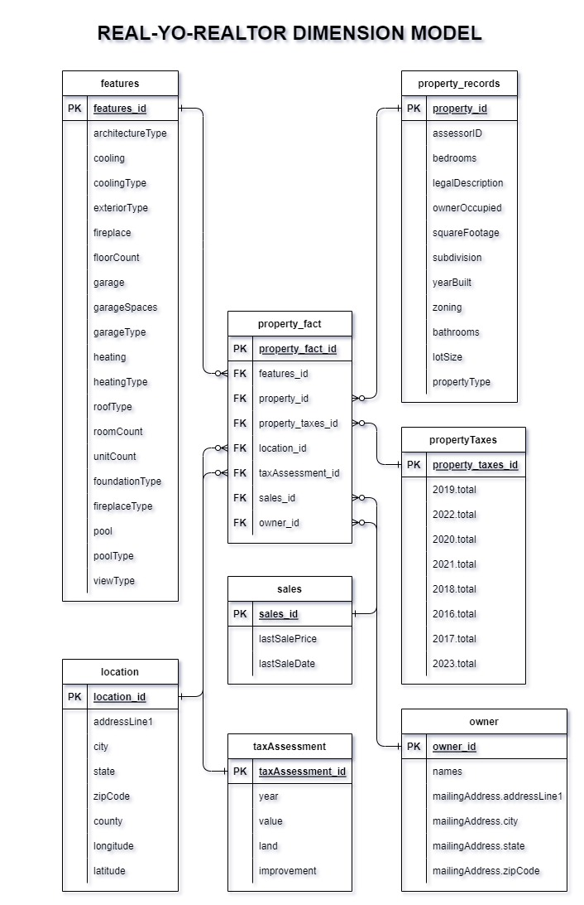

# AirRealtor: Real Estate Data Integration, an end-to-end data pipeline on AWS

## Project Description
  
AirRealtor, an AWS-based end-to-end data pipeline, seamlessly integrates Apache Airflow, AWS S3, and EC2 for efficient ETL operations. The pipeline 
extracts real estate data from the Realty Mole Property API via RapidAPI, utilizing comprehensive property information. Apache Airflow orchestrates 
streamlined workflows, while AWS S3 securely stores the transformed data. AWS EC2 ensures scalability for dynamic computing needs. AirRealtor stands 
as a powerful tool for real estate professionals, providing up-to-date insights and facilitating data-driven decision-making in the competitive 
real estate landscape. With its integrated workflow and AWS infrastructure, AirRealtor optimizes the ETL process, offering a reliable solution for 
real-time analytics.

AirRealtor performs the following tasks:
  -  Fetches real estate data from the Realty Mole Property API via RapidAPI.
  -  Utilizes Apache Airflow to orchestrate end-to-end ETL workflows.
  -  Implements transformation processes to clean and normalize data.
  -  Securely stores the transformed and processed data in AWS S3.
  -  Utilizes AWS EC2 to ensure scalability for dynamic computing needs.
  -  Develops robust monitoring and logging mechanisms.
  -  Establishes seamless integration with RapidAPI to fetch real-time updates from the Realty Mole Property API.
  -  Loads the processed and transformed data into a centralized data warehouse on AWS S3.

## Business Problem Statement - The call for AirRealtor project
The current state of Real-yo Realtor's data infrastructure poses significant challenges to the organization's agility and responsiveness. 
Manual data handling processes result in time-consuming workflows, leading to delays in decision-making. Disparate data sources contribute 
to inconsistencies and inaccuracies, hindering the reliability of information crucial for strategic planning. The absence of a robust ETL 
solution further exacerbates these issues, limiting the organization's ability to harness the full potential of its data assets.

## Objectives (For Data Engineer)
  -  Develop and implement ETL pipelines using Airflow to automate data workflows.
  -  Integrate data from diverse sources such as property listings, market trends, and customer interactions.
  -  Ensure real-time or near-real-time data processing for timely decision-making.
  -  Improve data quality, accuracy, and reliability through transformation processes.
  -  Establish a scalable and maintainable data integration architecture.

## Tech Stack
  -  Python: For scripting and data manipulation tasks.
  -  APIs: To connect and fetch data from various real estate platforms and databases.
  -  Apache Airflow: To orchestrate and automate ETL workflows.
  -  AWS EC2: Virtual servers for hosting and running data processing tasks.
  -  AWS S3: Object storage for storing and managing large volumes of data.

## Benefits (For Data Engineers)
  -  Increased operational efficiency through automated data workflows.
  -  Enhanced data accuracy and quality, reducing errors in decision-making.
  -  Improved scalability and flexibility for handling growing data volumes.
  -  Real-time insights into market trends and customer behavior.
  -  Streamlined collaboration between data engineering and other business units.

## Data Source
The data source for AirRealtor is the Realty Mole Property API, accessed via <a href="https://rapidapi.com/realtymole/api/realty-mole-property-api" target="_blank">RapidAPI</a>. This API provides comprehensive 
property information essential for real estate analytics.

## Pipeline Overview

Here's a complete overview of the pipeline:

The airflow DAG orchestrates the ETL (Extract, Transform, Load) process for real estate data.
When an airflow DAG starts:
  - It executes the python script to fetch json data from Realty Mole Property API into a staging area in an EC2 instance.
  - The python script transforms the data into pandas dataframe.
  - The data is cleaned and organized using pandas library.
  - Finally, the cleaned and transformed dataframes are loaded to an AWS S3 bucket.

## AirRealtor Data Dimension Model

## Setting up the pipeline
I've written steps to recreate this pipeline. Refer to the top section [🔝 Go to Top](#) to locate setup.ipynb notebook file.

## Challenges
  -  Setup and Configuration: Setting up Airflow and making it work with other systems can be tricky at first.
  -  Debugging and Monitoring: Finding and fixing problems in your workflows is hard, so it's important to keep track of what's happening.
  -  Versioning and Deployment: Changing and updating your workflows for different uses can be difficult, and putting those changes into action needs a careful process.
  -  Scalability: Making sure Airflow can handle more and more tasks as you need it to is important. You have to set it up in a way that works well as things get busier.
  -  Security Concerns: Keeping important information safe, like passwords, is crucial. You need to know how to handle and protect these secret codes.

## Recommendations
  -  Setup and Configuration: Ensure thorough setup and configuration; pay attention to external connections.
  -  Debugging and Monitoring: Establish robust logging and monitoring practices for effective issue identification.
  -  Versioning and Deployment: Implement a well-organized version control system for smooth workflow changes.
  -  Security Concerns: Prioritize secure credential management, safeguarding sensitive information.
  -  Scalability: Configure Airflow for scalability to handle growing task loads efficiently.
  -  Community and Documentation: Stay engaged with the community for support; supplement with additional resources if official documentation lacks clarity.

